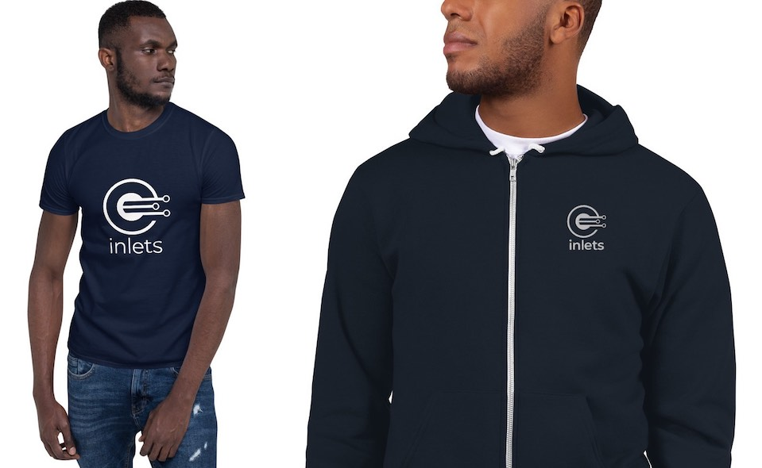

# Cloud Native Tunnel

Inlets is a Cloud Native Tunnel written in Go, you can use it to connect services to other networks like the Internet through NAT, firewall and restrictive networks.

inlets creates a tunnel between two networks using a websocket and optional TLS for encryption. The main use-case for inlets is to expose a private API or service on the Internet, or to gain incoming network access (ingress) to a private network.

There are two flavours of inlets tunnels depending on your needs:

* [inlets](https://github.com/inlets/inlets) - L7 tunnel for HTTP/HTTPS, free and OSS. MIT license
* [inlets-pro](https://github.com/inlets/inlets-pro) - L4 tunnel for any TCP traffic including automatic encryption with TLS. Commercial license: support & enterprise solutions available

In the diagram we can see a developer has exposed a Node.js website on his or her laptop through the use of inlets and a server that has a public IPv4 address.

The remote server is called an "exit-node" or "exit-server" because that is where traffic from the private network appears. The user's laptop has gained a "VirtualIP" and users on the Internet can now connect to it using that IP.

## Use-cases

There are many uses for inlets, some users consume it as a networking tool and others built it into their own projects and products.

For teams and individuals:

* As a freelancer, you can share a blog or website with a client or with your team
* When integrating with API that use webhooks such as Stripe, PayPal or GitHub, you can test live with your local machine
* To get a public IP address for your IngressController or services on a Kubernetes cluster
* To access your homelab or Raspberry Pi cluster using SSH
* As a zero-touch VPN, which can traverse NAT and firewalls
* As an alternative to SaaS and or proprietary offerings such as [Ngrok](https://ngrok.io) and [Argo Tunnel](https://www.cloudflare.com/en-gb/products/argo-tunnel/)

For companies:

* When integrating APIs with data-feeds from third-parties
* For command and control of: services within private VPCs, IoT devices, Point of Sale (PoS) and servers on remote sites or on-premises
* As an alternative to an expensive data-center uplink such as [AWS Direct Connect](https://aws.amazon.com/directconnect/) or [Azure Express Route](https://docs.microsoft.com/en-us/azure/expressroute/expressroute-introduction).

## Exit-servers

Exit-servers run the inlets server component (the control-plane) on a given port and accept incoming requests from the inlets client. You can create these manually and customise them, or automate them through tooling such as [Terraform](https://www.terraform.io) or bash.

There are two community projects which automate creating exit-servers for inlets/-pro using public cloud such as DigitalOcean, Packet, Scaleway, Civo, AWS and GCP.

* [inletsctl](https://github.com/inlets/inletsctl)  - create exit-servers for inlets/-pro
* [inlets-operator](https://github.com/inlets/inlets-operator) - Kubernetes automation to create exit-servers for inlets/-pro including a CRD

## Buy SWAG

**Buy an inlets t-shirt or hooodie**: [buy yours on Gumroad now](https://gumroad.com/openfaas)

## Get started

* [Quick-start: expose a HTTP server with a public IP](/get-started/quickstart-http?id=expose-a-http-server-with-a-public-ip)

* [Quick-start: get SSH access from anywhere](/get-started/quickstart-tcp-ssh?id=get-ssh-access-from-anywhere)

* [Video: Get public endpoints in seconds with inlets and create-react-app](https://www.youtube.com/watch?v=jrAqqe8N3q4&feature=youtu.be)

Kubernetes:

* [Quick-start: expose Your IngressController and get TLS from LetsEncrypt](/get-started/quickstart-ingresscontroller-cert-manager?id=expose-your-ingresscontroller-and-get-tls-from-letsencrypt)

* [Quick-start: expose a Kubernetes Pod with KinD](/get-started/quickstart-k8s?id=expose-nginx-from-your-kubernetes-cluster-with-kind)

## Pricing

inlets, inlets-operator and inletsctl are all OSS and distributed under the MIT license.

**Buy an inlets t-shirt or hooodie**: [buy yours on Gumroad now](https://gumroad.com/openfaas)

> Contact [sales@openfaas.com](mailto:sales@openfaas.com) for a quote on commercial support, training, and custom solutions for inlets or inlets-pro.

**Buy now:** [inlets-pro](/pricing/)

## Connect with the community

Follow [@inletsdev](https://twitter.com/inletsdev) on Twitter.

Join the `#inlets` channel on [OpenFaaS Slack](https://slack.openfaas.io/)

> [Contribute to this documentation on GitHub](https://github.com/inlets/docs/)
