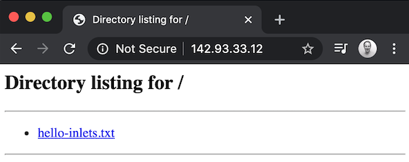

# Cloud Native Tunnel

Inlets is a Cloud Native Tunnel written in Go, you can use it to connect services to other networks like the Internet through NAT, firewall and restrictive networks.

inlets creates a tunnel between two networks using a websocket and optional TLS for encryption. The main use-case for inlets is to expose a private API or service on the Internet, or to gain incoming network access (ingress) to a private network.

There are two flavours of inlets tunnels depending on your eneds:

* [inlets](https://github.com/inlets/inlets) - L7 tunnel for HTTP/HTTPS, free and OSS
* [inlets-pro](https://github.com/inlets/inlets-pro) - L4 tunnel for any TCP traffic including automatic encryption with TLS and commercial support

In the diagram we can see a developer has exposed a Node.js website on his or her laptop through the use of inlets and a server that has a public IPv4 address.


The remote server is called an "exit-node" or "exit-server" because that is where traffic from the private network appears. The user's laptop has gained a "VirtualIP" and users connect to it using that IP.

## Use-cases

There are many uses for inlets and it can be used either on its own or as part of an integrated solution. 

For teams and individuals:

* As a freelancer, you can share a blog or website with a client or with your team
* When integrating with API that use webhooks such as Stripe, PayPal or GitHub, you can test live with your local machine
* To get a public IP address for your IngressController or services on a Kubernetes cluster
* To access your homelab or Raspberry Pi cluster using SSH

For companies:

* When integrating APIs with data-feeds from third-parties
* For command and control of remote devices or Point of Sale (PoS)
* As an alternative to an expensive data-center uplink such as AWS Direct Connect or Azure Express Route.

## Exit-servers

Exit-servers run the inlets server component (the control-plane) on a given port and accept incoming requests from the inlets client. You can create these manually and customise them, or automate them through tooling such as [Terraform](https://www.terraform.io) or bash.

There are two community projects which automate creating exit-servers for inlets/-pro using public cloud such as DigitalOcean, Packet, Scaleway, Civo, AWS and GCP.

* [inletsctl](https://github.com/inlets/inletsctl)  - create exit-servers for inlets/-pro
* [inlets-operator](https://github.com/inlets/inlets-operator) - Kubernetes automation to create exit-servers for inlets/-pro including a CRD

## Get started

The easiest way to start is with `inletsctl`:

```bash
# Remove `sudo to install to the local folder
curl -sLSf https://raw.githubusercontent.com/inlets/inletsctl/master/get.sh | sudo sh

sudo inletsctl download [--pro]
```

Start a Python HTTP fileserver (on port 8000)

```sh
export STORE=/tmp/store/

mkdir -p $STORE
cd $STORE
echo "Hi" > hello-inlets.txt
python -m SimpleHTTPServer 8000
```

Now create an exit-server using inletsctl to automate the creation of the public host and the installation of the inlets server component:

```sh
inletsctl create --provider digitalocean \
  --region lon1 \
  --access-token-file ~/digitalocean-api
```

Run the command given for `inlets client` to connect to the server.

```sh
export UPSTREAM=http://127.0.0.1:8000
inlets client --remote "ws://142.93.33.12:8080" \
  --token "GhdoqT9NfZWbSlW0jHEQHcBPpC9Krv9xPxURdGrM9R3yXOwl7o6H2Pam3TnkMGNx" \
  --upstream $UPSTREAM
```

You can now access the Python HTTP server by going to the IP address given, i.e. `http://142.93.33.12`.



Finally feel free to run `inletsctl delete` with the command given to you.

```sh
inletsctl delete --provider digitalocean --id "179755668"
```

Finally, if you would like to add TLS you can do [this manually using my tutorial](https://blog.alexellis.io/https-inlets-local-endpoints/), or use [inlets-pro](https://github.com/inlets/inlets-pro) to expose Caddy, Traefik or a Kubernetes IngressController and obtain a certificate for your computer.

## Connect with the community

Follow [@inletsdev](https://twitter.com/inletsdev) on Twitter.

Join the `#inlets` channel on [OpenFaaS Slack](https://slack.openfaas.io/)