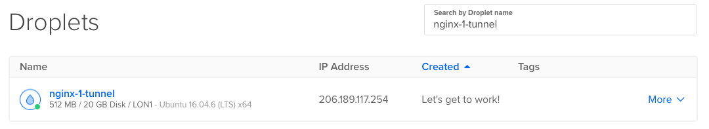
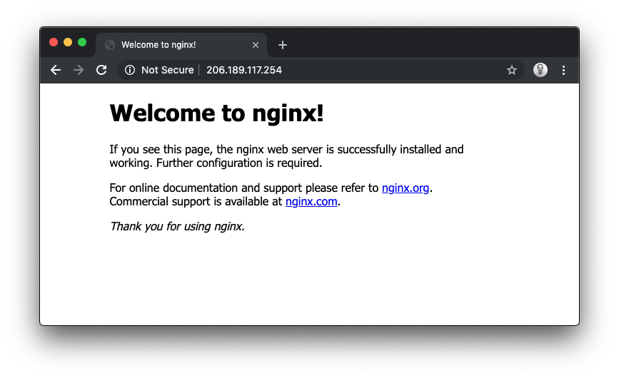

# Expose Nginx from your Kubernetes cluster with KinD

In this quick-start the inlets-operator for Kubernetes will enable us to get a public IP address for a LoadBalancer service in our private cluster.

## Pre-reqs

* A computer or laptop running MacOS or Linux, or Git Bash or WSL on Windows
* Docker for Mac / Docker Daemon - installed in the normal way, you probably have this already
* [KinD](https://github.com/kubernetes-sigs/kind) - the "darling" of the Kubernetes community is Kubernetes IN Docker, a small one-shot cluster that can run inside a Docker container
* [arkade](https://github.com/alexellis/arkade) - arkade is an app installer that takes a helm chart and bundles it behind a simple CLI

## Create the Kubernetes cluster with KinD

We're going to use [KinD](https://github.com/kubernetes-sigs/kind), which runs inside a container with Docker for Mac or the Docker daemon. MacOS cannot actually run containers or Kubernetes itself, so projects like Docker for Mac create a small Linux VM and hide it away.

You can use an alternative to KinD if you have a preferred tool.

Get a KinD binary release:

```bash
curl -Lo ./kind "https://github.com/kubernetes-sigs/kind/releases/download/v0.7.0/kind-$(uname)-amd64"
chmod +x ./kind
sudo mv /kind /usr/local/bin
```

Now create a cluster:

```bash
 kind create cluster
Creating cluster "kind" ...
 ✓ Ensuring node image (kindest/node:v1.17.0) 🖼
 ✓ Preparing nodes 📦  
 ✓ Writing configuration 📜 
 ✓ Starting control-plane 🕹️ 
 ✓ Installing CNI 🔌 
 ✓ Installing StorageClass 💾 
Set kubectl context to "kind-kind"
You can now use your cluster with:

kubectl cluster-info --context kind-kind

Have a nice day! 👋
```

We can check that our single node is ready now:

```bash
kubectl get node -o wide

NAME                 STATUS     ROLES    AGE   VERSION   INTERNAL-IP   EXTERNAL-IP   OS-IMAGE       KERNEL-VERSION     CONTAINER-RUNTIME
kind-control-plane      Ready   master   35s   v1.17.0   172.17.0.2    <none>        Ubuntu 19.10   5.3.0-26-generic   containerd://1.3.2
```

The above shows one node Ready, so we are ready to move on.

## Install the inlets-operator

You can use arkade or helm to install the inlets-operator:

```bash
# Get arkade
curl -sSLf https://dl.get-arkade.dev/ | sudo sh
```

Save an access token for your cloud provider as `$HOME/access-token`, in this example we're using DigitalOcean.

```bash
arkade install inlets-operator \
 --provider digitalocean \
 --region lon1 \
 --token-file $HOME/do-access-token
```

> You can run `arkade install inlets-operator --help` to see a list of other cloud providers.

Set the `--region` flag as required, it's best to have low latency between your current location and where the exit-servers will be provisioned.

## Expose a LoadBalancer

We'll create a test deployment of Nginx:

```bash
kubectl run nginx-1 --image=nginx --port=80 --restart=Always
```

Now create a service of type LoadBalancer:

```bash
kubectl expose deployment nginx-1 --port=80 --type=LoadBalancer
```

Now we see the familiar "Pending" status, but since we've installed the inlets-operator, a VM will be created on DigitalOcean and a tunnel will be established.

```bash
kubectl get svc -w

NAME         TYPE           CLUSTER-IP    EXTERNAL-IP   PORT(S)        AGE
kubernetes   ClusterIP      10.96.0.1     <none>        443/TCP        2m25s
nginx-1      LoadBalancer   10.104.90.5   <pending>     80:32037/TCP   1s
```

Access your local cluster service from the Internet
Using the IP in "EXTERNAL-IP" you can now access Nginx:

```bash
NAME         TYPE           CLUSTER-IP    EXTERNAL-IP   PORT(S)        AGE
kubernetes   ClusterIP      10.96.0.1     <none>        443/TCP        4m34s
nginx-1      LoadBalancer   10.104.90.5   <pending>     80:32037/TCP   2m10s
nginx-1      LoadBalancer   10.104.90.5   206.189.117.254   80:32037/TCP   2m36s
```

Here you can see the VM that was provisioned:



And we can access the service directly using the IP shown via `kubectl`



The exit-nodes created by the inlets-operator on DigitalOcean cost around 5 USD per month by using the cheapest VPS available with 512MB RAM available.

Now if you'd like to delete the tunnel and its exit-server, simply delete the Kubernetes service:

```bash
kubectl delete svc/nginx-1
```

If you want to, you can see the logs of the operator with `kubectl logs inlets-operator -f`.

